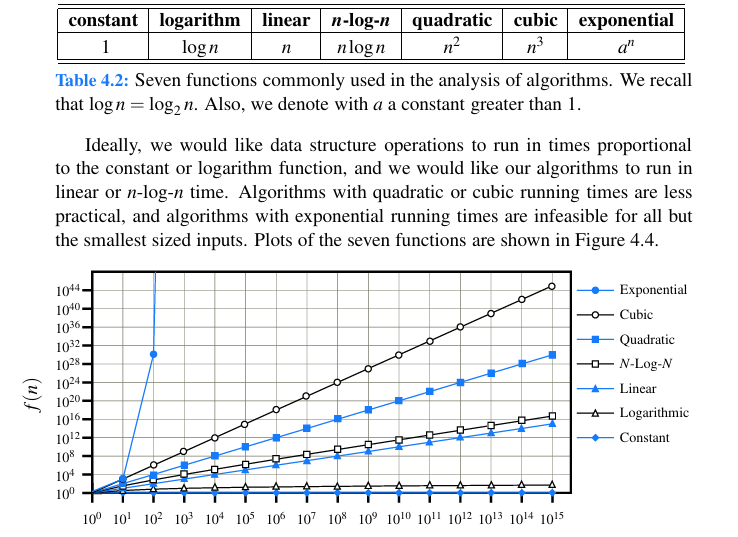

## Algorithm Analysis
> We can't measue the time execution of any function because the time execution depends external issues like the OS, how many procesess are running and more.
### 4.1.1 Moving Beyond Experimental Analysis
- Counting primitives Operations like
  -  Assigning a value to a variable
  -  Following an object reference
  -  Performing an arithmetic operation (for example, adding two numbers)
  -  Comparing two numbers
  -  Accessing a single element of an array by index
  -  Calling a method
  -  Returning from a method
- Focusing on the Worst-Case Input: 
  - instead we get the avarage-case we need to have many input and identidy the avarage case, it is difficult.
  - In the word-case we develop algorithms for the wost-case.
### 4.2 The Seven Functions Used in This Book
1. The constant fn
2. The logarithm fn
3. The linear fn
4. The N-Log-N fn
5. The quadratic fn -> nested loops
6. The cubic fn
  - Polynomials: linear, quadratic and cubic fn
7. The exponencial fn -> f(n)=bⁿ
   - summations: 
   - Geometric sum:

### 4.3 Asymptotic Analysis
- f(n) is O(g(n)) ~= f(n) is O(g(n))