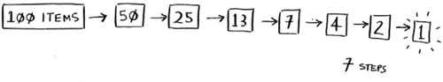
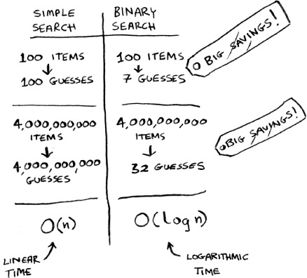
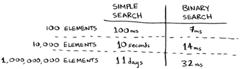
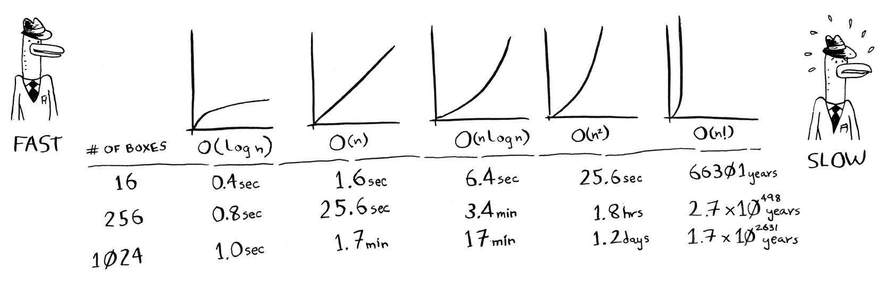
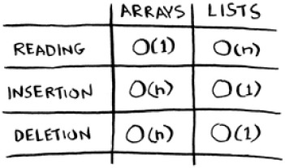
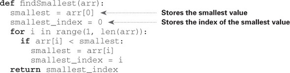

## Learning Path
### Capítulo 1.Introducción a los algoritmos
### Binary Search
- [x] Complete
- **Caso de Uso:** 
> Supongamos que estás buscando a una persona en la guía telefónica (¡qué frase tan pasada de moda!). Su nombre comienza con K. Podrías comenzar desde el principio y seguir pasando páginas hasta llegar a las K. Pero es más probable que comiences en una página en el medio, porque sabes que las K estarán cerca del medio de la guía telefónica.
- **Entradas**: Lista ordenada de elementos, y el item a buscar
- **Consideraciones**: Empezar desde el medio, eliminas la mitad que no te sirve, luego tienes otra mitad para hacer lo mismo
  
- **Logaritmos**: `Log₁₀100=2`
- **Big O Notation**: `log₂n=y`
  - En caso halla 1024 elementos de una lista ->`log₂n=1024` -> `n=10` intentos
- **Running Time**:
  - *Linear Time*: Cuando el tiempo es directamente proporcional al numero de elemntos: 100e = 100guesses
  - *logarithmic time/log time*: 100e = 7guesses
  - 
- **Big O notation**: how fast an algorithm is.
  - Los algorithms pueden crecer a ritmos diferentes
  
>La notación O grande indica qué tan rápido es un algoritmo.  La búsqueda simple necesita verificar cada elemento, por lo que se necesitarán n operaciones. El tiempo de ejecución en notación Big O es O ( n ). ¿Dónde están los segundos? No hay ninguno: Big O no te dice la velocidad en segundos. La notación O grande le permite comparar el número de operaciones. Te indica qué tan rápido crece el algoritmo.
- **BinarySearch**: O(log₂n)
- **SimpleSearch**: O(n)
- **QuickSort**: O(n*log₂n)
- **SelectionSort**: O(n²)
- **TravelingSalesPerson**: O(n!) soon..
> Como se comporta con dibujar una cuadricula de 16 cuadrados?
- O(log₂n)=16 -> n=4
- O(n)=16 -> n=16

### Selection Sort - Chap-2
- **como funciona la memoria**: similar a las butacas de los cines(*cada butaca tiene su id*)
- **Arrays**: todas sus datos estan de forma continua
  - Al agregar nuevos elementos se tendria que buscar un espacio donde esten juntos
  - Tamaño fijo
- **Linked List**: Resuelven el problema de los arrays
  - id en cada elemento
  - direcciones de memoria enlazadas
  - ya no moveras tus elementos
  - No puedes leer elementos en una posicion dada, porque no sabes la direccion -> read O(n)
- **Inserting into the middle of a list**: 
  - Arrays: cambiar a que apunta el elemento anterior
  - Linked List: desplazar el resto de los elementos hacia abajo

- randon-access: arrays - sequential-acess:linked
- **Selection sort**: *second-algorithm*
- **Constantes en Big O notation**: O(n(n-1))=O(n²)
- **SSort vs QSort**: QSort es mas rapido
  - SSort: solo recive un array
  
