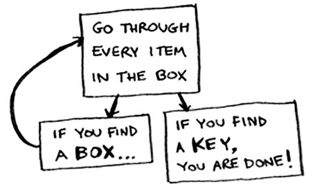
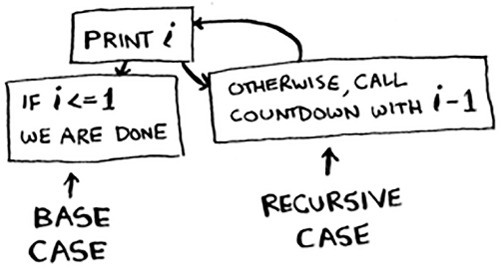
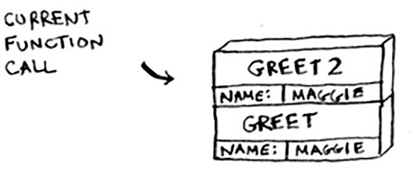

## Chapter 3. Recursion
### Topics
- Recursividad
- Divide y Venceras
### Recursividad
> Supongamos que estás cavando en el ático de tu abuela y te encuentras con una misteriosa maleta cerrada con llave.La abuela te dice que probablemente la llave de la maleta esté en esta otra caja. La caja contiene mas cajas dentro.
- El algoritmo **#3** usado aqui seria, crear un funcion que resuelva el caso base, y luego repetirlo para todos los demas. 
- Un enfoque mejorado

- Recursividad es donde la funcion se llama asi misma.
- **No hay beneficio de rendimiento al usar la recursividad**
### Base case and recursive case
- Para no terminar en un bucle infinito
- **Base Case**: la condicion para finalizar el caso 
- **Recursive Case**: cuando la funcion se llama asi misma

### The stack
- **The call Stack**: se usa dentro de la recursividad
  - insertar: al principio de la fila
  - leer: lees el elemento superior y se elimina
  - solo 2 opciones: insertar y leer
- **The call stack inside the computers**: 
  ` def greet(name):
    print "hello, " + name + "!"
    greet2(name)
    print "getting ready to say bye..."
    bye()`
    
  > cuando llamas a una función desde otra función, la función que llama se pausa en un estado parcialmente completado.
  - ultimo en añadir, primero en salir
### La pila de llamadas con recursividad
- sacando el factorial de un numero: 5! = 5*4! = 5*4*3*2!
- la pila juega un papel importante en la recursividad: ya que las funciones se ejecutan de adentro hacia afuera f(g(x)): primero en salir sera un g(x)
  - **Esto sigue la política LIFO (Last In, First Out), lo que significa que la última función en ser llamada es la primera en terminar.**
### Problems
- Almacenar varias funcions sin completar, podria generar alguna perdidad de rendimiento, mejor seria repensarlo
  -  You can rewrite your code to use a loop instead.
  - You can use something called tail recursion. That’s an advanced recursion topic that is out of the scope of this book. It’s   also only supported by some languages, not all.