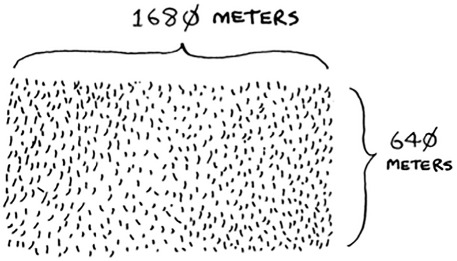
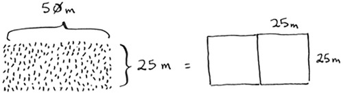
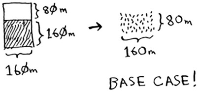
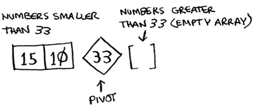
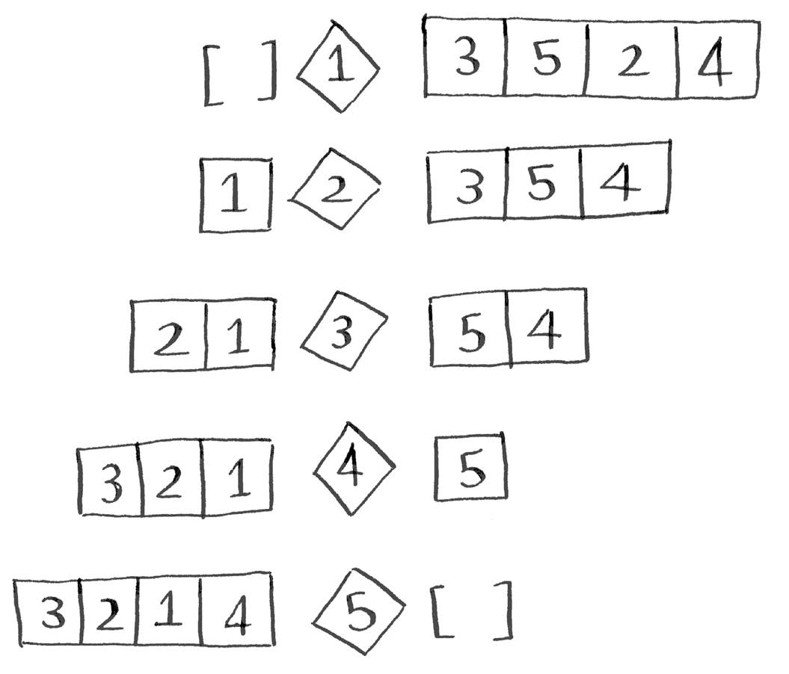
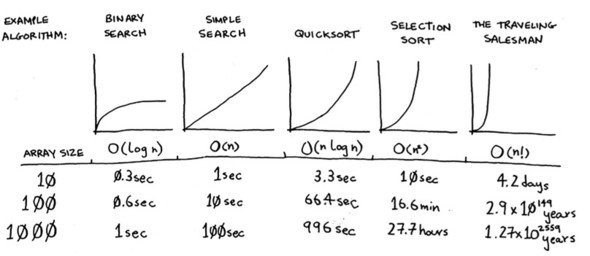
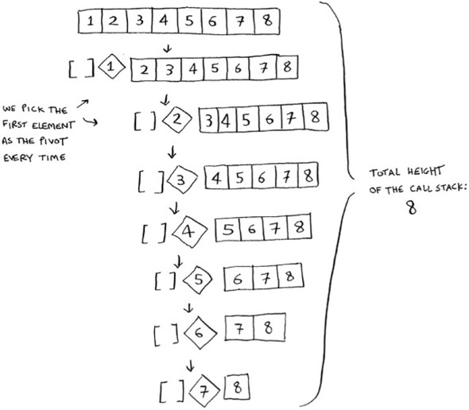
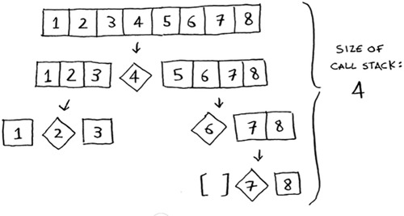

## Quicksort
> divide y vencerás (D&C), una técnica recursiva muy conocida para resolver problemas.
### Divide y vencerás (D&C)
- QuickSort usa D&C por defecto 

- Dos pasos para resolver un problema con D&C
    1 . Descubra el caso base. Este debería ser el caso más sencillo posible.
      - Seria mejor si un lado fuera multiplo del otro
        
    2 . Divida o disminuya su problema hasta que se convierta en el caso base.
      - 1680*640 -> 640*2 + 400 -> 400*1+240 -> 240*1 + 160 -> 160*1 + 80 -> 80*160 -> **base case**
      
- Tener en cuenta que ninguna de las funciones se ejecutan si no se ejecuta el caso base:
  
> Cuando escribes una función recursiva que involucra una matriz, el caso base suele ser una matriz vacía o una matriz con un elemento. Si estás atascado, inténtalo primero.
### Un adelanto de la programación funcional
- Simplemente porque los lenguajes funcionales se te haran mas faciles de aprender
### Quicksort
- Algoritmo de clasificacion 
- mas rapido que SelectionSort
- Pivot: en teoria deberia ser el elemento mas grande, pero basta con elejir un numero aleatorio
- Proceso:
    1. Encontrar un pivote: para este caso el primer elemento
    2. Ordenar los menores del pivot a la izquierda y los mayores a la derecha
    
    3. Llame a quicksort recursivamente en las dos submatrices.
    
### Pruebas inductivas
- Caso base -- Caso inductivo 
> Si para subir una escalera primero debo dar el primer paso y luego repetir
> Entonces podemos deducir que si demostramos que cierta logica funcion para el caso 1, 2, 3 funcionara asi sucesivamente para los otros casos.
### Notación Big O revisada
- Qsort depende del pivot que se elija, con respecto a su velocidad. 

- **merge sort**: O(n*logn)
- en el peor de los casos Qsort podria tomar O(n²) siendo similar a SSort
- *entonces no deberiamos usar Msort en lugar que Qsort*
### Merge sort vs. quicksort
- En realidad siempre hay una constante en cualquiern notacion
  - O(n)=c*n -> **pero no se toma en consideracion porque nunca comparas las mismas notaciones**
>  a veces la constante puede marcar la diferencia. La clasificación rápida versus la clasificación por combinación es un ejemplo. Quicksort tiene una constante más pequeña que la ordenación por combinación. Entonces, si ambos tienen tiempo O ( n log n ), la clasificación rápida es más rápida. Y la clasificación rápida es más rápida en la práctica porque llega al caso promedio con mucha más frecuencia que al peor de los casos.
### Caso promedio versus peor caso
- Worst case -> cuando elijes el primer elemento y el array ya esta ordenado -> O(n)
  
- Better case: siempre elijes el elemento central como pivot en una lista ordenada -> O(logn)
  
- El mejor caso tambien es el caso promedio