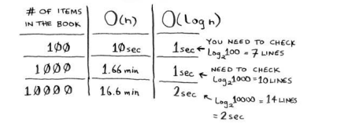
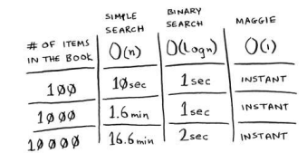
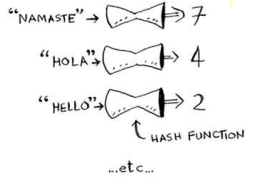

## Hash tables
> When a customer buys produce, you have to look up the price in a book. If  the book is unalphabetized, it can take you a long time to look through every single line for apple.
- Simple Search(chap-1): si esta sin alfatetizar **O(n)**
- Binary Search(chap-2): si esta alfabetizado **O(logn)**
- 
> Although BS es faster than SS, the customer might get angry if we are slow in looking for something, so we need to ask to someone to tell us what is the price of this **buddy Maggie**
- \
- **Two data Structure so far - arrays and lists -**
> I won’t talk about stacks because you can’t really “search” for something in a stack
- We are using a `array` and it will take two items: kind of produce and the price
  - Here, we can sort this arrays by name, we can run binary search on it to find the price of an item. So you can find items in O(logn) time
  - But we want to search in O(1) -> The reason of **Maggie** -> **Hash functions**

### Hash functions
- A  hash function is a function where you put in a string and you get back a number
- 
- Requiriments:
  - must be consistent. Each time you enter the same string, you can return the same result. 
  - It should map different words to different numbers
  - In the best case, every different word should map to a different number
- Process:
  - Start with an ampty array
  - You need to feed you array
  - We will store all of your prices in this array
  - We want to store a "apple" -> pass with the hash function and then store the price/key of the string in thep position that tell us the hash function
- the hash function tells you exactly where the price is stored, so you don’t have to search at all! his works because
  - The hash function consistently maps a name to the same index
  - The hash function maps diferent strings to diferent indexes
  - The hash function knows how big your array is and only returns valid indexes
- **data structure hash table**
- Arrays and lists map straight to memory, but hash tables are smarter.
- They use a hash function to intelligently figure out where to store elements.
- They are also known as hash maps, maps, dictionaries, and associative arrays.
- And hash tables use an array to store the data, so they’re equally fast.
- You’ll probably never have to implement hash tables yourself. Because any good language will have an implementation for hash tables