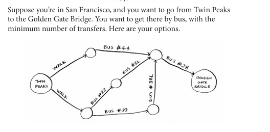
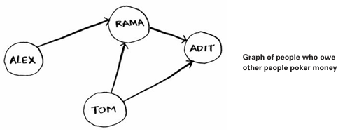
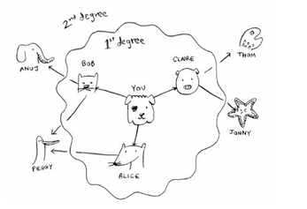
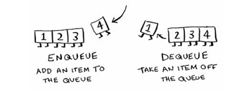
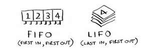
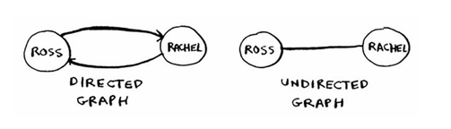
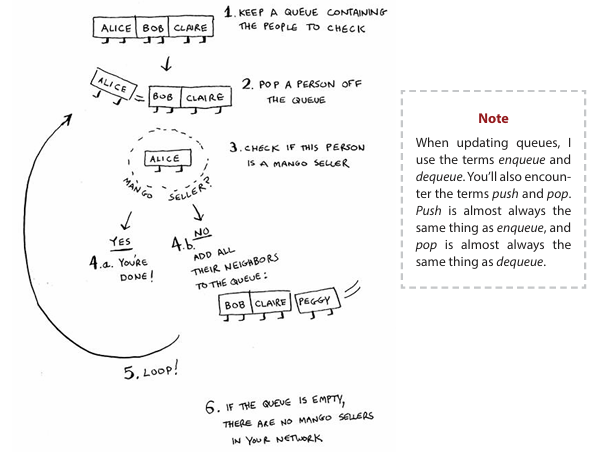

### Breadth-first search
- First graph algorihm calles **breadth-first search BFS**
- Goal: find the shortest distance between two things
- Use Case

- find the shortest route -> **shortest-path problem**
> To find out the how to find the shortest path
> - Model the problem as a graph
> - Solve the problem using breadth-irst search
### What si a graph

- Each one it is maded up of **nodes** and **edges**
- A node can be directly connected to many other nodes -> **neighbors**

### Breadth-irst search
- You can answers two question with this algorithm
  - Question type 1: Is there a path from node A to node B?
    - la manera aqui es buscar hasta encontrar a alguien, o algo. Como buscar amigos de tus amigos que vendan o tienen lo que estas buscando
  - Question type 2: What is the shortest path from node A to node B?

### 2.  Finding the shortest path -> find the closer mango seller
- La manera en como BFS funciona es: primero busca en el primer grado de conecciones  y si no hay ninguna recien pasa a la segunda y asi ..
-  
- !Algo importane aqui:
  - BFS find out in the same order in which the'r added -> `data strcuture -> queue`

#### Queues
- Like daily life
- Similar to `data structure -> stacks`
- Only two operations -> enquee and dequee
- 
>  the queue is called a FIFO data structure: First In, First Out. In contrast, a stack is a LIFO data structure: Last In, First Out.

###  Implementing the graph
**Requeriments**
- There are a lot of nodes 
- Each note is connected to neighboring nodes
  - you -> bob
- `Data Strcuture for this is -> a hash table` 
  - it allows us to map key to a value
- It doesnt matter in what order we add a new neiborhood -> *Hash tables have no ordering*
- The connection between nodes is **directed graph** -> it iso nly on one way.

###  Implementing the algorithm
