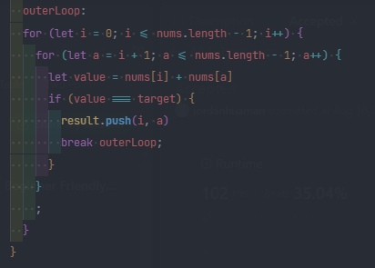

### Lemonade Change
> Es mejor primero ir de casos especificos a mas complejos, ademas es mejor primero ir por los errores o las salidas del problema.

> Nombrar los bucles for y salir mediante el breack

