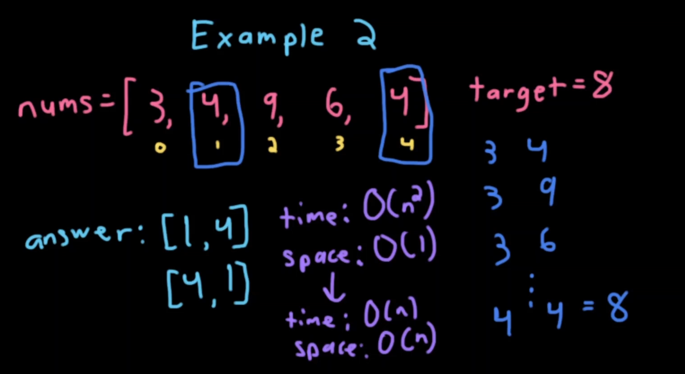
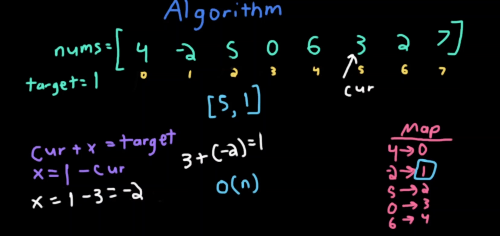

## Time Complexity 
- BigO(n²) when we have a nested loop, in the first resolve of the problem, we use a 2 for-loop, so the time complexity is **n²**.
- **O(n²)** can be reduce to **O(n)**, when the *space-complexity* is O(1). Then, the resutl would be *time-complexity*: **O(n)** and the *space-complexity*: **O(n)** 

- Algorithm to reduce the complexity is the **Hasp-map** and condicionals like *if*;

- [More about the space-complexity](https://dev.to/mwong068/big-o-space-complexity-lcm)
## Algorithms used
| Algorithm | INFO |
| ------ | ------ |
| Hash-map||